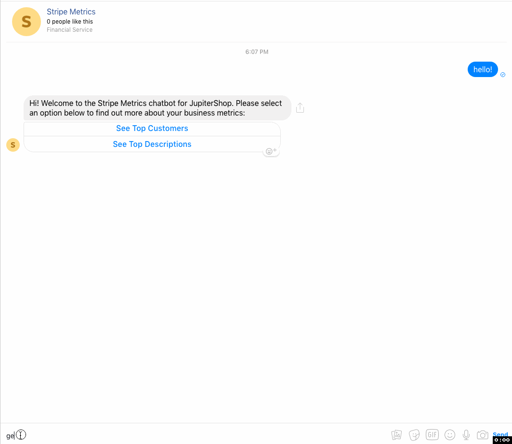
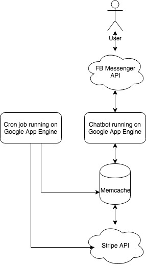

# Stripe Metrics Chat Bot

## User Guide

To get started, simply message the chatbot on FB via [this link](http://m.me/558428604567910).

You can find out information about the top customers across your store and the most lucrative item descriptions/adjectives, e.g. "Sleek".

Here's what you can expect to see while you're using the bot:

## Developer Guide

### Intro

The chatbot is built as a web app on Google App Engine responding to requests from the [FB Messenger API](https://messengerdevelopers.com/resources/platform-overview). Here is a system diagram of the overall architecture:

### Details

#### App

The application (logic in `main.py`) responds to a few types of requests from the FB messenger API:

1. Verification request: this is a `GET` request which registers our application to Facebook and associates it with our page. It has already been set up.
1. `POST` requests which include messages from users.
    * Messages: these are free-form text messages. We always respond with the main menu to these.
    * Postbacks: this is how FB Messenger informs us when a user clicks a button, this includes the payload we included in that button so we know which button they have pressed.

The application sends two types of messages to users via the FB Messenger API:

1. Text messages: these are free-form text messages containing useful/status information.
1. Button messages: messages with both text and a list of button(s) (and associated payloads for postbacks).

#### Data

Data is collected via the Stripe API (logic in `stripe_stats.py`, hitting the Charges and Customer endpoints) and stored in memcache (logic in `stripe_memcache.py`, note: in a production enviroment, we should persist information in a db as well, but memcache works for this lightweight prototype).

A cron job fills up memcache with all of the charge information from the Stripe API on a regular schedule without doing extra work if we've already seen all the charges.

In the event memcache doesn't have the necessary information, the app can fall back to hitting the Stripe API as well.

#### Running/Deploying

In order to run this project, you'll need to download and install the Google App Engine Cloud SDK for Python [here](https://cloud.google.com/appengine/docs/standard/python/download).

To run locally: `dev_appserver.py ./` (from project directory), then send requests to `http://localhost:8080`.

To deploy the app: `gcloud app deploy app.yaml`.

To deploy the cron job: `gcloud app deploy cron.yaml `.

#### Libraries

The external package `stripe` (and it's dependencies) are included in the `lib/` directory and configured to be included in the GAE app via the `appengine_config.py` file.
